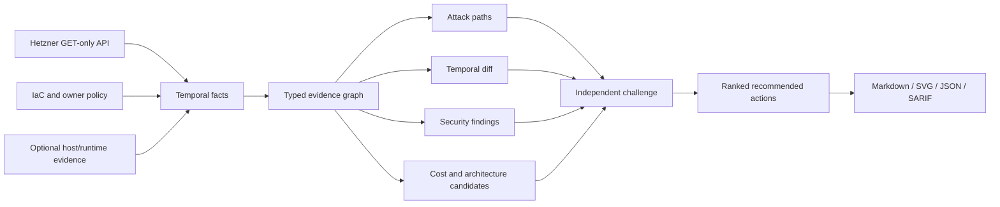

# Hetzner Audit

### Know your Hetzner Cloud: what is exposed, what is wasted, and what to fix next.

[](https://github.com/jpolec/hetzner-cloud-audit-skills/blob/main/LICENSE)
[](https://pypi.org/project/hetzner-audit/)
[](https://pypi.org/project/hetzner-audit/)


**Free and open source (Apache-2.0).** No account, no SaaS, no telemetry. `hetzner-audit` runs on your machine and sends nothing anywhere except read-only `GET` requests to the Hetzner API.

---

## Do you really know your Hetzner infrastructure?

- **Is any database reachable from the Internet?** Or only through one careless firewall rule?
- **Can a compromised preview box reach your production database?** Hetzner Cloud Firewalls **do not filter private networks**, so it probably can.
- **Are you paying for things nobody uses?** Unattached volumes, stopped servers that are still billed, deprecated server types.
- **Which three servers make up half of your bill?** Which of them could be smaller or run on ARM?
- **What changed since last week?** A new public port, or a firewall that quietly disappeared?

One read-only token and one command answer all of it. You get an architecture map, a blast-radius view, a per-VM cost breakdown, and a ranked list of what to do next. Every finding cites its evidence.

### ⚡ Two ways to start

| | 🤖 **AI agent skill**: fastest, recommended | 🛠️ **Command-line tool** |
|---|---|---|
| **Install** | `npx skills add https://github.com/jpolec/hetzner-cloud-audit-skills --skill hetzner-security-audit` | `uvx hetzner-audit …`, or `git clone` and `uv run` |
| **Run** | Ask your agent: *"audit my Hetzner infrastructure"* | `hetzner-audit audit`, `hetzner-audit map` |
| **What happens** | The agent runs the preflight, snapshot, audit, and diagrams. It then explains the findings in plain language and walks you through the fixes. | Markdown, JSON, SARIF, and SVG files land in your output folder |
| **Best for** | A first look, questions like *"can staging reach prod?"*, and guided remediation | CI, cron jobs, scripting, and repeatable reports |

Both use the same read-only engine and the same evidence rules. Works with **Claude Code, OpenAI Codex**, and other SKILL.md-compatible agents.


<sub>Example project, generated by `hetzner-audit map` from a read-only token. Public IP addresses are never rendered.</sub>

> Independent open-source project. Not affiliated with or endorsed by Hetzner or Cloudflare. v0.4 is alpha: review every high-impact result before acting on it.

---

## 1. What you get

| | |
|---|---|
| 🔐 **Security** | Public exposure, Cloudflare bypass, blast radius on shared private networks, and trust-boundary paths |
| 💶 **Cost** | Catalog cost per VM, spend concentration, identifiable waste, and rightsizing or ARM candidates |
| 🗺️ **Architecture** | AWS-style diagrams: network zone, private network, locations, role tiers, and trust sources |
| ✅ **Actions** | A ranked to-do list: saving, evidence level, risk of acting, and the concrete next step |
| 🔁 **Change tracking** | Timestamped snapshots, coverage-aware diff, a GitHub Action, and SARIF |
| 🤖 **Agent-ready** | Ships as a SKILL.md agent skill for Claude Code, OpenAI Codex, and compatible agents |

What makes it different from a cost dashboard or a port scanner: **it separates what it proved from what it suspects.**

| Result | Meaning |
|---|---|
| `confirmed` / `reachable` | Every link in the chain is evidenced: network, firewall, host rule, listener, service config |
| `needs_validation` / `cloud_path_present` | Hetzner topology allows it, but host or runtime evidence is missing |
| `unknown` | No path was seen, but coverage is too incomplete to claim isolation |

A missing collector is reported as a gap. It is never reported as "secure". Confirmed savings stay at zero until there is proof. The tool never inflates a number.

---

## 2. Quick start

Steps 1 and 2 are the same for both ways. Then pick **A** (agent) or **B** (command line).

### Step 1: create a read-only token

In [Hetzner Console](https://console.hetzner.com/): **your project → Security → API tokens → Generate API token → Read**.

Never choose **Read & Write**; the tool makes `GET` requests only. The [illustrated token guide](https://github.com/jpolec/hetzner-cloud-audit-skills/blob/main/docs/token-setup.md) covers every step, including revocation.


### Step 2: load it into your terminal without leaking it

```sh
printf 'Hetzner read-only token: '
IFS= read -rs HCLOUD_TOKEN; printf '\n'
export HCLOUD_TOKEN
```

This keeps the token out of shell history. **Never paste it into an agent prompt**, command argument, `.env`, screenshot, or report.

### Option A: AI agent skill (about 30 seconds)

```sh
npx skills add https://github.com/jpolec/hetzner-cloud-audit-skills --skill hetzner-security-audit
```

Start your agent (for example `claude` or `codex`) **from the same terminal**, so it inherits `HCLOUD_TOKEN` without ever seeing the value. Then just ask:

```text
audit my Hetzner infrastructure
```

Or go straight to what you care about:

```text
draw the architecture of my Hetzner project
can anything reach my production database?
where am I overpaying on Hetzner?
what changed since the last audit?
```

The agent checks the setup with `doctor`, confirms the project scope with you, and collects a read-only snapshot. It then loads the network, Linux, Docker, PostgreSQL, Redis, backup, or cost guidance only when the evidence makes it relevant. For cost-first work there is a dedicated skill: `--skill hetzner-cost-audit`.

### Option B: command-line tool

```sh
uvx hetzner-audit doctor --report-dir ./_output              # preflight: token, API, project scope
uvx hetzner-audit audit --format markdown --output _output/audit.md
uvx hetzner-audit map --format svg --output _output/architecture.svg
```

`uvx` runs the [PyPI package](https://pypi.org/project/hetzner-audit/) without installing it. You can also work from source:

```sh
git clone https://github.com/jpolec/hetzner-cloud-audit-skills
cd hetzner-cloud-audit-skills
uv run hetzner-audit audit --format markdown --output _output/audit.md
```

To pin a release, use `uvx --from 'git+https://github.com/jpolec/hetzner-cloud-audit-skills@v0.4.0' hetzner-audit --help`. For CI, see the [GitHub Action](#7-track-changes-in-ci).

`doctor` confirms the token works without printing it. It shows the project scope (server, firewall, network, and volume counts), so you can check you picked the right project. It also warns if reports would land in a Git-tracked directory.

### No token yet? Try the demo

```sh
git clone https://github.com/jpolec/hetzner-cloud-audit-skills && cd hetzner-cloud-audit-skills
uv run hetzner-audit audit --input benchmarks/scenarios/v0.1-insecure.json --format markdown --output demo.md
```

This runs against a synthetic, intentionally insecure fixture. You can also just read the [sample security report](https://github.com/jpolec/hetzner-cloud-audit-skills/blob/main/examples/reports/demo.md) and [sample cost report](https://github.com/jpolec/hetzner-cloud-audit-skills/blob/main/examples/reports/demo-cost-v0.3.md).

### When you are done

```sh
unset HCLOUD_TOKEN   # then revoke the token in Hetzner Console
```

Treat reports as sensitive. They contain names, private addresses, and topology. Do not commit real reports or snapshots to a public repository.

---

## 3. The report: what to fix, in order


Every audit opens with three things:

1. **At a glance.** Scope, confirmed findings, hypotheses that still need host or runtime evidence, and collection gaps. Cost is split into **immediately identifiable waste** (no telemetry needed), **optimization candidates** that need RAM and disk data, and **confirmed savings**, plus spend concentration (for example, "top 3 VMs = 56% of spend").
2. **What this audit knows.** Coverage for cost, utilization, ownership, backups, and host evidence, and the provenance: snapshot time, net catalog pricing, VAT and traffic excluded, and no invoice reconciliation.
3. **Recommended actions**, ranked. Each one has a saving, an **evidence level** (HIGH, MEDIUM, or LOW, with the reason), the risk of acting, and the concrete next step. For example:
   - *"Migrate jobs-1 off deprecated cx22. The same-family successor is unavailable in this location right now. Available replacement: cpx22, +15.00/mo. ARM alternative: cax11, +1.50/mo, which needs multi-arch images and a benchmark."*

The detailed findings follow, each with its evidence chain, impact, and remediation. Indirect paths are kept separate from direct exposure: a database reachable only by pivoting through another host is not reported as Internet-exposed.

---

## 4. Security: exposure and blast radius

Out of the box, the API-only layer checks:

- public SSH, Docker API, Kubernetes API, PostgreSQL, Redis, Elasticsearch, and MongoDB;
- public servers with no cloud firewall attached;
- web origins open to any address while peer servers accept web traffic only from Cloudflare;
- lateral paths from unrelated workloads to database, identity, and secrets hosts;
- environment-policy violations, when labels and an owner policy define intent;
- disabled deletion protection, missing backups, missing ownership labels, and deprecated server types.

> ⚠️ **Hetzner Cloud Firewalls do not filter private network traffic** ([Hetzner FAQ](https://docs.hetzner.com/cloud/firewalls/faq/)). Every server on a private network reaches every port on every other member, and firewall rules with private source ranges have no effect on that traffic. `hetzner-audit` models it that way, so only host-firewall evidence can mark a private path as blocked.


Ask direct questions:

```sh
hetzner-audit ask "Can the Internet reach any database?" --input snapshot.json
hetzner-audit path --from staging-worker --to prod-db --protocol tcp --port 5432 --input snapshot.json
hetzner-audit explain HETZ-XLY-002-0123456789abcdef --input snapshot.json
```

`explain` prints the stored evidence chain, attack path, verifier challenge, unresolved prerequisites, and remediation. It does not ask a model to invent a new explanation.


The Hetzner API cannot see host listeners, Docker port publishing, PostgreSQL HBA, Redis ACLs, or guest memory. Those findings stay `needs_validation` and show what evidence is missing. One reason this matters: **Docker-published ports bypass UFW.**

---

## 5. Cost: waste first, then optimization

```sh
hetzner-audit cost --metrics-days 30 --format markdown --output cost.md
hetzner-audit map --format svg --view cost --output cost.svg
```

- **Identifiable waste:** unattached volumes, unassigned IPs, stopped-but-billed servers, and stale snapshots. These need no telemetry.
- **Optimization candidates:** rightsizing and x86 → ARM moves based on 30-day CPU p95. Only one candidate per server counts toward the total, so savings are never double-counted.
- **Structure signals:** spend concentration, storage-heavy servers (volumes above half the compute cost), and deprecated types with a replacement and cost delta.
- **Confirmed savings stay at zero** until RAM, disk, owner intent, and rollback are evidenced. The tool reports missing proof instead of inflating the number.


The cost audit is deliberately conservative. A stopped server is still billed. ARM savings require image, dependency, and performance validation. The tool has no resize, stop, delete, detach, or purchase action.


---

## 6. Architecture maps

```sh
hetzner-audit map --format svg --view architecture --output architecture.svg   # --theme dark available
hetzner-audit map --format svg --view connectivity --output connectivity.svg
hetzner-audit map --format svg --view cost --output cost.svg
hetzner-audit map --format markdown --output network-map.md                    # Mermaid; renders on GitHub
```

The architecture view is laid out like an AWS or OCI diagram:

- summary tiles across the top;
- trust sources on the left (Internet, Cloudflare, Tailscale, allow-lists);
- the network zone and the private network (Hetzner's VPC equivalent);
- one column per location, crossed by role tiers;
- a band for servers outside any private network and for Storage Boxes;
- recommended actions and a legend along the bottom.

`--max-actions` controls how many actions are drawn.

| Exposure | Meaning |
|---|---|
| critical | A sensitive port or all ports are open to any address, or the server has no cloud firewall |
| public | Other ports are open to any address |
| proxied | Reachable only from Cloudflare ranges |
| private | No public ingress except Tailscale's WireGuard port |

The maps show firewall intent, not host or application controls. They never print public IP addresses, but they do reveal your topology, so keep them private. See the [example map](https://github.com/jpolec/hetzner-cloud-audit-skills/blob/main/examples/reports/network-map.md).

---

## 7. Track changes in CI

```sh
hetzner-audit snapshot --output before.json --read-only --no-ssh
# ... later ...
hetzner-audit snapshot --output after.json --read-only --no-ssh
hetzner-audit diff before.json after.json --fail-on-regression
```

The diff reports new public edges, asset and fact changes, and collector coverage regressions. A resource that failed to collect is not reported as deleted. Each fact records its source, observation time, collector version, and run ID.

```yaml
- uses: jpolec/hetzner-cloud-audit-skills@v0.4.0
  env:
    HCLOUD_TOKEN: ${{ secrets.HCLOUD_TOKEN }}
  with:
    mode: audit
    policy: policies/infrastructure.toml
    format: sarif
    output: hetzner-audit.sarif
```

Run live collection only from protected `schedule` or `workflow_dispatch` jobs, and never expose the token to fork code. See the full [GitHub Action guide](https://github.com/jpolec/hetzner-cloud-audit-skills/blob/main/docs/github-action.md). SARIF works best when a finding maps to IaC. Runtime-only topology findings stay in Markdown and JSON.

**Tell it what "correct" means.** Generic best practice is weaker than your own architecture contract:

```toml
[environments.production]
may_receive_from = ["production"]

[services.postgres]
public = false

[ssh]
public = false
```

```sh
hetzner-audit audit --policy policies/example-policy.toml --format markdown --output audit.md
```

Observed facts, owner policy, IaC declarations, and inferred hypotheses are kept as separate records.

---

## 8. Safety model

- **Read-only.** The code contains no Hetzner `POST`, `PUT`, or `DELETE` call. Use a **Read** token anyway.
- **No SSH, no probing.** Findings come from API state and evidence you supply; the tool never port-scans.
- **No auto-remediation.** Every action is a plan with validation and rollback steps for a human to review.
- **Secrets and personal data are redacted.** Snapshots have these removed:
  - tokens, passwords, private keys, and `user_data`;
  - email addresses and reverse-DNS names;
  - Storage Box usernames and hostnames;
  - SSH public-key material and comments.
- **Nothing leaves your machine.** No telemetry and no hosted backend.

See the [threat model](https://github.com/jpolec/hetzner-cloud-audit-skills/blob/main/docs/threat-model.md) and [permissions](https://github.com/jpolec/hetzner-cloud-audit-skills/blob/main/docs/permissions.md).

---

## 9. How it works



The pipeline is `collect → reason → verify → recommend`. The deterministic verifier is a separate component, not an independent human or agent reviewer. Agent-generated candidates without an independent verifier stay `needs_validation`.

More detail: [architecture](https://github.com/jpolec/hetzner-cloud-audit-skills/blob/main/docs/architecture.md), [FinOps architecture](https://github.com/jpolec/hetzner-cloud-audit-skills/blob/main/docs/finops-architecture.md), [Cloudflare reference analysis](https://github.com/jpolec/hetzner-cloud-audit-skills/blob/main/docs/cloudflare-reference.md), [landscape](https://github.com/jpolec/hetzner-cloud-audit-skills/blob/main/docs/landscape.md).

---

## 10. Status and roadmap

| Capability | v0.4 status |
|---|---|
| Hetzner Cloud inventory with per-endpoint coverage, `doctor` preflight | Beta |
| Public exposure, Cloudflare bypass, private-network blast radius | Beta (host/runtime stays `needs_validation`) |
| Recommended actions with evidence levels | Beta |
| Architecture, connectivity, and cost diagrams (SVG, Mermaid, JSON) | Beta |
| Snapshots, temporal facts, and diff; GitHub Action; SARIF | Beta |
| `path`, `explain`, constrained `ask`; JSON/TOML owner policy | Beta |
| Cost: waste, concentration, rightsizing and ARM candidates | Experimental |
| Host evidence bundle (UFW, Docker, listeners, PostgreSQL, Redis) | Next |
| Terraform ↔ runtime drift | Next |
| Kubernetes on Hetzner (correlation only) | Later |
| AWS/GCP/Azure/OCI adapters, MCP server | Not planned for now |

See the [roadmap](https://github.com/jpolec/hetzner-cloud-audit-skills/blob/main/docs/roadmap.md). The synthetic benchmark plants 33 security problems: 23 meet the deterministic evidence contract and 10 intentionally remain `needs_validation`. This measures fixture behavior, not real-world detection accuracy ([methodology](https://github.com/jpolec/hetzner-cloud-audit-skills/blob/main/benchmarks/README.md)).

---

## 11. Contributing

Issues, rule ideas, and pull requests are welcome, especially real-world cases the tool gets wrong. See [CONTRIBUTING.md](https://github.com/jpolec/hetzner-cloud-audit-skills/blob/main/CONTRIBUTING.md) and [AGENTS.md](https://github.com/jpolec/hetzner-cloud-audit-skills/blob/main/AGENTS.md).

```sh
uv sync --extra dev
uv run ruff check . && uv run mypy src && uv run pytest
./scripts/demo.sh                              # regenerate examples/reports
uv run python scripts/validate_artifacts.py
```

Runtime code uses only the Python standard library. Licensed under Apache-2.0 for its explicit patent grant.

## Maintainer

Created and maintained by [Jakub Połeć](https://github.com/jpolec).

Report security issues through [GitHub private vulnerability reporting](https://github.com/jpolec/hetzner-cloud-audit-skills/blob/main/SECURITY.md), not a public issue.

If `hetzner-audit` saved you money or caught something scary, a ⭐ on GitHub helps others find it.
