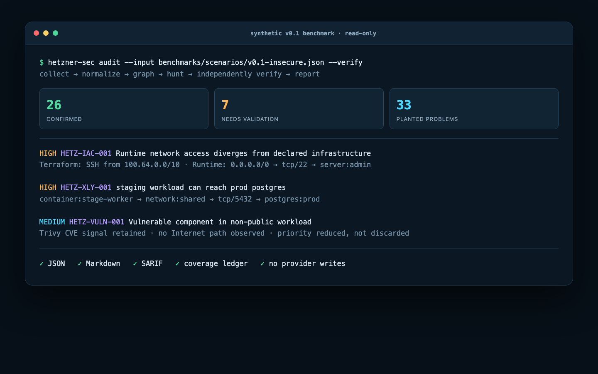
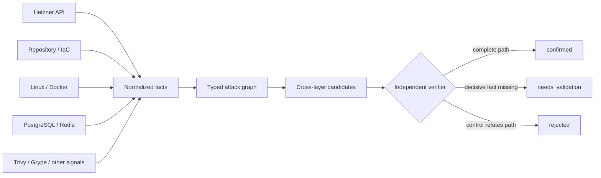
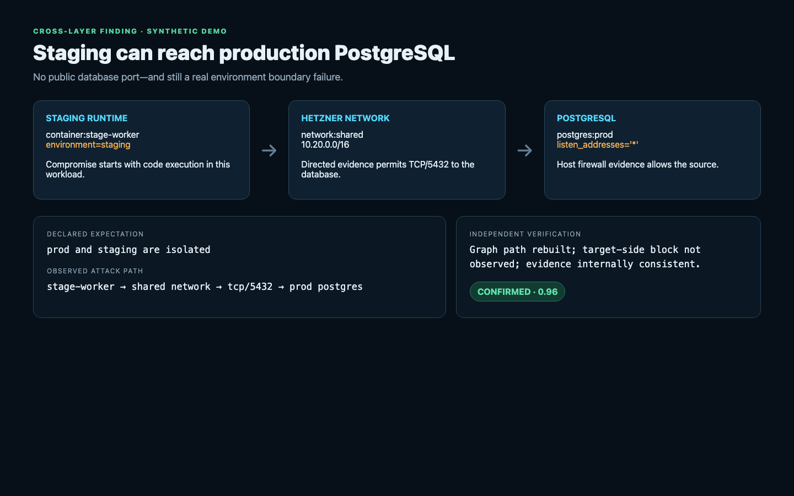

# hetzner-security-skills

**Agentic security auditing for Hetzner infrastructure.**

Traditional scanners inspect layers independently. This project correlates current Hetzner Cloud topology, network policy, Linux hosts, containers, PostgreSQL, Redis, IaC intent, and external scanner signals—then independently challenges each material finding.

> This is an independent open-source project and is not affiliated with or endorsed by Hetzner or Cloudflare. v0.1 is an alpha and is not production-ready.



## The difference

```text
Terraform says:  SSH only from 100.64.0.0/10
Hetzner says:    22/tcp accepts 0.0.0.0/0
Attack path:     Internet → tcp/22 → admin server
Result:          HIGH · confirmed configuration drift · confidence 0.98
```

The system does not merely concatenate hcloud, Trivy, and database warnings. It follows `collect → reason → verify`:





## Install for an AI coding agent

The intended UX is one top-level skill that loads only the relevant modules:

```sh
npx skills add https://github.com/OWNER/hetzner-security-skills \
  --skill hetzner-security-audit
```

Then ask your agent:

```text
audit my Hetzner infrastructure
```

`OWNER` will be replaced with the authenticated GitHub account before publication. The skill is agent-neutral and designed for Claude Code, OpenAI Codex, and other SKILL.md-compatible agents.

## Install the CLI

```sh
python3 -m venv .venv
. .venv/bin/activate
python -m pip install .
hetzner-sec --help
```

Offline synthetic demo—no token, SSH, Docker daemon, or network access required:

```sh
hetzner-sec audit \
  --input benchmarks/scenarios/v0.1-insecure.json \
  --format markdown \
  --output report.md \
  --coverage-ledger coverage-ledger.json
```

Read-only live inventory:

```sh
export HCLOUD_TOKEN='use-a-read-only-project-token'
hetzner-sec inventory --format json --output inventory.json --read-only --no-ssh
hetzner-sec audit --format json --output findings.json --read-only --no-ssh
```

Never put the token in a command, file, or report. `--dry-run` performs no API request. v0.1's live collector contains fixed `GET` operations and no provider mutation method.

## Use cases

### Detect reviewed-IaC drift

Compare declared firewall intent with current Hetzner state. A mismatch becomes material only when it changes a trust boundary or reachable service path.

### Find private-network lateral movement

Show that a staging workload can reach a production database even when PostgreSQL is not public. Join environment labels, shared-network edges, host filtering, Docker routing, listener state, and HBA/auth context.

### Contextualize a container CVE

Map a Trivy or Grype signal to the actual container, host, public/private path, and compensating controls. A vulnerability remains visible while exposure changes priority and confidence.

### Audit database controls in context

Evaluate ordered `pg_hba.conf`, roles, TLS, grants, Redis protected mode/ACLs, and service bind addresses together with provider and host network controls. A broad bind alone is not automatically a finding.

### Build a reviewable security baseline

Use stable findings, evidence records, and a deterministic coverage ledger in CI. Later runs prioritize changed evidence and visible gaps instead of repeating a free-form scan.

## Implemented checks

v0.1 exposes 16 rule IDs across eight categories:

| Category | Examples |
|---|---|
| Hetzner/network | public SSH, Docker API, Kubernetes API, PostgreSQL, Redis; public hosts with missing firewall evidence |
| IaC drift | declared source ranges versus observed runtime access |
| Cross-layer | dev/staging → production PostgreSQL or Redis over a proven graph path |
| Docker | privileged mode, Docker socket, host PID, host network |
| PostgreSQL | broad `trust` HBA, unexpected superusers |
| Redis | broad bind + protected mode off + no observed authentication |
| Resilience | production stateful assets without complete backup evidence |
| CVE context | scanner signal mapped to asset and public reachability |

The emphasis is quality over rule count. Absence-based findings remain `needs_validation` until collector completeness is proven.

## Skills

- `hetzner-security-audit` — top-level reconnaissance, coverage, correlation, verification, and reporting.
- `hetzner-cloud-audit` — read-only provider inventory.
- `hetzner-network-audit` — topology and reachability.
- `linux-security-audit` — explicitly authorized read-only host inspection.
- `docker-security-audit` — runtime isolation and network context.
- `postgres-security-audit` — HBA, roles, TLS, grants, operations, and cross-layer paths.
- `redis-security-audit` — protected mode, ACL/TLS, command surface, persistence, and reachability.
- `hetzner-backup-audit` — provider and application recovery evidence.

The workflow is inspired by Cloudflare's independently developed [security-audit-skill](https://github.com/cloudflare/security-audit-skill). This repository is not a fork or dependency. The exact comparison and attribution are in [docs/cloudflare-reference.md](docs/cloudflare-reference.md).

## Output

```sh
hetzner-sec audit --format json
hetzner-sec audit --format markdown
hetzner-sec audit --format sarif
hetzner-sec network --input snapshot.json --severity high --verify
hetzner-sec postgres --input snapshot.json --verify
hetzner-sec docker --input snapshot.json --verify
```

Every record separates severity from confidence and carries assets, expected/actual state, evidence, attack path, prerequisites, impact, verifier result, remediation, references, and discovery time. Schemas live in [`schemas/`](schemas/).

## Safety model

- Read-only Hetzner collection by construction; no create/update/delete methods.
- SSH off by default and allowed only with explicit operator configuration.
- No live exploitation, brute force, restarts, firewall changes, or active scanning.
- Repository content, labels, resource names, and scanner output are untrusted data—not agent instructions.
- Secrets are never required in command arguments and sensitive property names are redacted.
- External scanners are signal providers; their warnings are not automatically confirmed.

Read [permissions](docs/permissions.md), the [threat model](docs/threat-model.md), and [security policy](SECURITY.md) before live use.

## Benchmark status

The synthetic benchmark plants 33 known problems: 26 meet the deterministic confirmation contract and 7 remain `needs_validation` by design. It covers the required drift, private PostgreSQL path, and non-public CVE scenarios. Unit tests also exercise clean VPN-scoped SSH and an unattached firewall rule.

This is fixture recall—not proof of real-world accuracy. See [benchmarks/README.md](benchmarks/README.md) for methodology and limitations.

## Development

```sh
python -m pip install -e '.[dev]'
ruff check .
mypy src
pytest
python -m build
gitleaks detect --no-banner --redact --no-git
```

The runtime has no third-party Python dependencies. Tests can also run with the standard library:

```sh
PYTHONPATH=src python3 -m unittest discover -s tests -v
```

## Architecture and research

- [Architecture](docs/architecture.md)
- [Landscape and gap analysis](docs/landscape.md)
- [Cloudflare reference analysis](docs/cloudflare-reference.md)
- [Threat model](docs/threat-model.md)
- [Roadmap](docs/roadmap.md)

## Limitations

The API collector is intentionally minimal and has not been tested against a real project in this environment. Linux/SSH, Docker runtime, PostgreSQL catalog, Redis runtime, and Terraform state adapters are specified but not fully implemented. The graph uses normalized evidence and cannot infer uncollected host/network controls. The deterministic verifier is component-separated but not equivalent to a fresh human or agent reviewer. MCP is deferred. Review every high-impact result before action.

## License

Apache License 2.0. It was chosen over MIT for its explicit patent grant and termination provisions, useful for a security tool expected to accept broad external contributions. See [LICENSE](LICENSE).
