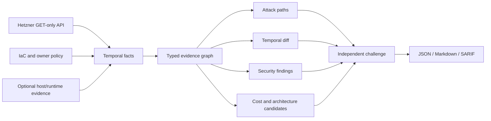

# hetzner-cloud-audit-skills

**Audit your Hetzner Cloud with one read-only token. No SSH, no writes. Every finding cites its evidence.**

It answers three questions about a Hetzner project:

1. **What is reachable from the Internet?** Open databases, public SSH, servers without a firewall.
2. **What can cross a trust boundary?** For example, can a staging box reach the production database?
3. **What changed since the last run?** New public ports, removed firewalls, coverage gaps.

It also draws a map of your network and produces an experimental cost report covering idle servers, rightsizing and ARM candidates.


<sub>Example project generated by `hetzner-audit map` from a read-only token. It is derived from a real deployment, with names, sizes, locations, and addressing changed. Public IP addresses are never rendered.</sub>

> Independent open-source project. Not affiliated with or endorsed by Hetzner or Cloudflare. v0.3 is alpha: review every high-impact result before acting on it.

## Why another scanner?

Most cloud scanners report "port 5432 is open in the firewall" and stop there. This tool separates what it **proved** from what it **suspects**:

| Result | Meaning |
|---|---|
| `confirmed` / `reachable` | Every link in the chain is evidenced: network, firewall, host rule, listener, service config |
| `needs_validation` / `cloud_path_present` | Hetzner topology allows it, but host or runtime evidence is missing |
| `unknown` | No path was seen, but coverage is too incomplete to claim isolation |

A missing collector is reported as a gap. It is never reported as "secure".

## Quick start

### Choose how you want to run it

| You want to… | Use |
|---|---|
| Ask your AI agent (Claude Code, Codex, …) to audit your infrastructure | [Agent skill](#option-a-agent-skill) |
| Run a report from the terminal or on a schedule | [CLI](#option-b-cli) |
| Check infrastructure in CI and upload SARIF | [GitHub Action](#github-action-and-sarif) |
| See what the output looks like first | [Try it without a token](#try-it-without-a-token) |

### Try it without a token

This runs against a synthetic, intentionally insecure fixture. No Hetzner account is needed.

```sh
git clone https://github.com/jpolec/hetzner-cloud-audit-skills
cd hetzner-cloud-audit-skills
uv run hetzner-audit audit \
  --input benchmarks/scenarios/v0.1-insecure.json \
  --format markdown --output demo.md
```

Or just read the pre-generated [sample security report](https://github.com/jpolec/hetzner-cloud-audit-skills/blob/main/examples/reports/demo.md) and [sample cost report](https://github.com/jpolec/hetzner-cloud-audit-skills/blob/main/examples/reports/demo-cost-v0.3.md).

### 1. Create a read-only token

In [Hetzner Console](https://console.hetzner.com/): **your project → Security → API tokens → Generate API token → Read**.

Never choose **Read & Write**; the tool makes `GET` requests only. The [illustrated token guide](https://github.com/jpolec/hetzner-cloud-audit-skills/blob/main/docs/token-setup.md) covers every step, including revocation.


### 2. Load it without leaking it

```sh
printf 'Hetzner read-only token: '
IFS= read -rs HCLOUD_TOKEN; printf '\n'
export HCLOUD_TOKEN
```

This keeps the token out of shell history. Never paste it into an agent prompt, command argument, `.env`, screenshot, or report.

Then check the setup before collecting anything:

```sh
uvx hetzner-audit doctor --report-dir ./_output
```

`doctor` confirms the token works without printing it. It lists which Hetzner endpoints it can read and shows the project's scope (server, firewall, network, and volume counts), so you can check you picked the right project. It also warns if reports would land in a Git-tracked directory.

### Option A: agent skill

```sh
npx skills add https://github.com/jpolec/hetzner-cloud-audit-skills \
  --skill hetzner-security-audit
```

Then ask your agent:

```text
audit my Hetzner infrastructure
```

Works with Claude Code, OpenAI Codex, and other SKILL.md-compatible agents. The top-level skill loads the network, Linux, Docker, PostgreSQL, Redis, backup, and cost guidance only when the evidence makes it relevant.

### Option B: CLI

```sh
uvx hetzner-audit audit --read-only --no-ssh --format markdown --output audit.md
```

`uvx` runs the [PyPI package](https://pypi.org/project/hetzner-audit/) without installing it. To pin the Git tag instead:

```sh
uvx --from 'git+https://github.com/jpolec/hetzner-cloud-audit-skills@v0.4.0' hetzner-audit --help
```

When you are done:

```sh
unset HCLOUD_TOKEN   # then revoke the token in Hetzner Console
```

Treat `audit.md` as sensitive. It contains names, IP addresses, and topology. Do not commit real reports or snapshots to a public repository.

### What a report looks like


The [synthetic benchmark report](https://github.com/jpolec/hetzner-cloud-audit-skills/blob/main/examples/reports/demo.md) shows what the tool finds on an intentionally insecure setup.

## What the report contains

The report opens with an **At a glance** page, followed by **Recommended actions**:

- **At a glance:** scope, confirmed findings, hypotheses that still need host or runtime evidence, and collection gaps. Cost is split into immediately identifiable waste (no telemetry needed), optimization candidates that need RAM and disk data, and confirmed savings, plus spend concentration.
- **What this audit knows:** coverage for cost, utilization, ownership, backups, and host evidence, and the provenance (snapshot time, pricing basis, VAT and traffic excluded).
- **Recommended actions**, ranked. Each one has a saving, an evidence level (HIGH, MEDIUM, or LOW, with the reason), the risk of acting, and the concrete next step. The same actions appear at the bottom of the architecture, connectivity, and cost diagrams.

Confirmed savings stay at zero until RAM, disk, owner intent, and rollback are evidenced. The tool reports missing proof instead of inflating the number.

The detail follows:

- **Facts** confirmed by the Hetzner API.
- **Findings** with a complete evidence chain, impact, and remediation.
- **Hypotheses** that need host or runtime evidence before they can be confirmed.
- **Collection gaps** and stale evidence.
- **Indirect paths** kept separate from direct exposure: a database reachable only by pivoting through another host is not reported as Internet-exposed.

Out of the box, the API-only layer checks:

- public SSH, Docker API, Kubernetes API, PostgreSQL, Redis, Elasticsearch, and MongoDB;
- public servers with no cloud firewall attached;
- web origins open to any address while peer servers accept web traffic only from Cloudflare;
- broad private-network paths from unrelated workloads to DB, auth, or Vault-labelled hosts;
- environment-policy violations, when labels and an owner policy define intent;
- disabled deletion protection on production or foundational resources;
- production state with no observed native backup;
- missing ownership labels;
- servers on deprecated server types;
- stopped-but-billed servers, unattached volumes, and rightsizing or ARM candidates.

The Hetzner API cannot see host listeners, Docker port publishing, PostgreSQL HBA, Redis ACLs, or guest memory. Those findings stay `needs_validation` and show what evidence is missing.

## Commands

### Check the setup

```sh
hetzner-audit doctor --report-dir ./_output
```

It exits non-zero when the token is missing or rejected, or when core endpoints are unreadable. That makes it a useful first step in CI as well.

### Map the network

```sh
hetzner-audit map --format markdown --output network-map.md   # Mermaid diagram and table; renders on GitHub
hetzner-audit map --format svg --output architecture.svg      # architecture diagram (--theme dark)
hetzner-audit map --format svg --view connectivity --output connectivity.svg
hetzner-audit map --format svg --view cost --output cost.svg   # per-VM catalog cost, CPU p95, candidates
```

The SVG is laid out like a cloud architecture diagram:

- summary tiles across the top;
- trust sources on the left (Internet, Cloudflare, Tailscale, allow-lists);
- the network zone and the private network with its subnets (Hetzner's VPC equivalent);
- one dashed column per location, crossed by role tiers;
- servers outside any private network and Storage Boxes in their own band;
- a legend along the bottom.

The **connectivity** view shows each VM on its private network, with the ingress it accepts from the Internet, Cloudflare, and Tailscale. The **cost** view lists each VM's catalog cost, broken down by server, volumes, IPv4, and backups, with CPU p95 and the best candidate saving, which still needs validation.


> **Hetzner Cloud Firewalls do not filter private network traffic** ([Hetzner FAQ](https://docs.hetzner.com/cloud/firewalls/faq/)). Every server on a private network reaches every port on every other member, and firewall rules with private source ranges have no effect on that traffic. The tool models it that way, so only host-firewall evidence can mark a private path as blocked.

Each server is tagged by exposure:

| Exposure | Meaning |
|---|---|
| critical | A sensitive port or all ports are open to any address, or the server has no cloud firewall |
| public | Other ports are open to any address |
| proxied | Reachable only from Cloudflare ranges |
| private | No public ingress except Tailscale's WireGuard port |

It shows firewall intent, not host or application controls. It never prints public IP addresses, but it still reveals your topology, so treat it as private. See the [example map](https://github.com/jpolec/hetzner-cloud-audit-skills/blob/main/examples/reports/network-map.md).

### What is publicly reachable?

```sh
hetzner-audit ask "Can the Internet reach any database?" --input snapshot.json
```

### What can cross a trust boundary?

```sh
hetzner-audit path --from staging-worker --to prod-db \
  --protocol tcp --port 5432 --input snapshot.json
```


### What changed?

```sh
hetzner-audit snapshot --output before.json --read-only --no-ssh
# ... later ...
hetzner-audit snapshot --output after.json --read-only --no-ssh
hetzner-audit diff before.json after.json --fail-on-regression
```

The diff reports new public edges, asset and fact changes, and collector coverage regressions. A resource that failed to collect is not reported as deleted. Each fact records its source, observation time, collector version, and run ID.

### Why was this flagged?

```sh
hetzner-audit explain HETZ-XLY-002-0123456789abcdef --input snapshot.json
```

This prints the stored evidence chain, attack path, verifier challenge, unresolved prerequisites, and remediation. It does not ask a model to invent a new explanation.

### Tell it what "correct" means: owner policy

Generic best practice is weaker than your own architecture contract. You can write the policy as TOML or JSON:

```toml
[environments.production]
may_receive_from = ["production"]

[services.postgres]
public = false

[services.redis]
public = false

[ssh]
public = false
```

```sh
hetzner-audit audit --policy policies/example-policy.toml \
  --format markdown --output audit.md
```

Observed facts, owner policy, IaC declarations, and inferred hypotheses are kept as separate records.

## Cost audit (experimental)

```sh
npx skills add https://github.com/jpolec/hetzner-cloud-audit-skills \
  --skill hetzner-cost-audit

hetzner-audit cost --metrics-days 30 --format markdown --output cost.md
```

```text
Current catalog estimate:       EUR 220.00/month
Potential savings identified:   EUR 90.00/month · EUR 1,080/year
Confirmed savings:              EUR 0/month

Why zero confirmed?
Guest RAM, filesystem occupancy, owner intent, and rollback evidence are incomplete.
```

Each recommendation shows the current type and cost, CPU p95, the candidate type, the saving, risk, confidence, missing evidence, security and reliability impact, validation, and rollback. Only one candidate per server counts toward the total, so savings are not double-counted.

The cost audit is deliberately conservative:

- a stopped server is still billed;
- CPU-only rightsizing is never confirmed without guest RAM and disk evidence;
- ARM savings require image, dependency, and performance validation;
- the tool has no resize, stop, delete, detach, or purchase action.


`hetzner-audit map --view cost` draws the same analysis per VM. Each VM gets a status, a component bar, CPU p95 when metrics exist, and its best candidate saving:


## GitHub Action and SARIF

```yaml
- uses: jpolec/hetzner-cloud-audit-skills@v0.4.0
  env:
    HCLOUD_TOKEN: ${{ secrets.HCLOUD_TOKEN }}
  with:
    mode: audit
    policy: policies/infrastructure.toml
    format: sarif
    output: hetzner-audit.sarif
```

Run live collection only from protected `schedule` or `workflow_dispatch` jobs, and never expose the token to fork code. See the full [GitHub Action guide](https://github.com/jpolec/hetzner-cloud-audit-skills/blob/main/docs/github-action.md).

SARIF works best when a finding maps to IaC. Runtime-only topology findings are also available as Markdown and JSON, so they are not forced into a fake source location.

## Safety model

- **Read-only.** The code contains no Hetzner `POST`, `PUT`, or `DELETE` call. Use a **Read** token anyway.
- **No SSH, no probing.** Findings come from API state and evidence you supply; the tool never port-scans.
- **No auto-remediation.** Remediation is a plan with validation and rollback steps for a human to review.
- **Secrets and personal data are redacted.** Token, password, private-key, and `user_data` fields are stripped from snapshots, as are email addresses, reverse-DNS names, Storage Box usernames, and SSH public-key material and comments.

See the [threat model](https://github.com/jpolec/hetzner-cloud-audit-skills/blob/main/docs/threat-model.md) and [permissions](https://github.com/jpolec/hetzner-cloud-audit-skills/blob/main/docs/permissions.md).

## Capability status

| Capability | v0.3 status |
|---|---|
| Paginated Hetzner Cloud inventory with per-endpoint coverage | Beta |
| Public firewall exposure | Beta |
| Shared-network and lateral cloud paths | Beta (host/runtime stays `needs_validation`) |
| Snapshots, temporal facts, and diff | Beta |
| `path`, `explain`, constrained `ask` | Beta |
| Network map (Mermaid, SVG, JSON) | Beta |
| JSON/TOML owner policy | Beta |
| JSON, Markdown, SARIF output | Beta |
| Cost totals and potential savings | Experimental |
| Linux/Docker/PostgreSQL/Redis | Fixture and operator-evidence workflow |
| Live Terraform-state drift | Not complete |
| Kubernetes/CCM/CSI | Planned |
| AWS/GCP/Azure/OCI adapters | Future (shared engine) |
| MCP server | Deferred |

## How it works



The pipeline is `collect → reason → verify`. The deterministic verifier is a separate component, not an independent human or agent reviewer. Agent-generated candidates without an independent verifier stay `needs_validation`.

More detail: [architecture](https://github.com/jpolec/hetzner-cloud-audit-skills/blob/main/docs/architecture.md), [FinOps architecture](https://github.com/jpolec/hetzner-cloud-audit-skills/blob/main/docs/finops-architecture.md), [Cloudflare reference analysis](https://github.com/jpolec/hetzner-cloud-audit-skills/blob/main/docs/cloudflare-reference.md), [landscape](https://github.com/jpolec/hetzner-cloud-audit-skills/blob/main/docs/landscape.md), [roadmap](https://github.com/jpolec/hetzner-cloud-audit-skills/blob/main/docs/roadmap.md).

## Benchmark

The synthetic benchmark plants 33 security problems. 23 meet the deterministic evidence contract, and 10 intentionally remain `needs_validation`. This measures fixture behaviour, not real-world detection accuracy. See the [benchmark methodology](https://github.com/jpolec/hetzner-cloud-audit-skills/blob/main/benchmarks/README.md).

## Development

```sh
uv sync --extra dev        # or: python -m pip install -e '.[dev]'
uv run ruff check .
uv run mypy src
uv run pytest
./scripts/demo.sh          # regenerate examples/reports
uv run python scripts/validate_artifacts.py
```

Runtime code uses only the Python standard library. Contributions are welcome: see [CONTRIBUTING.md](https://github.com/jpolec/hetzner-cloud-audit-skills/blob/main/CONTRIBUTING.md) and [AGENTS.md](https://github.com/jpolec/hetzner-cloud-audit-skills/blob/main/AGENTS.md). Licensed under Apache-2.0 for its explicit patent grant.

## Maintainer

Created and maintained by [Jakub Połeć](https://github.com/jpolec), founder of [QuantJourney](https://quantjourney.cloud).

Report security issues through [GitHub private vulnerability reporting](https://github.com/jpolec/hetzner-cloud-audit-skills/blob/main/SECURITY.md), not a public issue.
