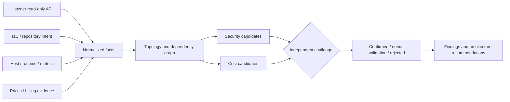

# hetzner-cloud-audit-skills

**Two agent skills for evidence-backed Hetzner infrastructure audits: security and cost.**

Install one skill, ask one question, and let the agent load only the relevant workflow:

| Skill | Ask your agent | What you get |
|---|---|---|
| `hetzner-security-audit` | `audit my Hetzner infrastructure` | Proven exposure and drift paths across cloud, network, host, containers, databases, and IaC |
| `hetzner-cost-audit` | `audit my Hetzner infrastructure costs` | Rightsizing and waste candidates backed by utilization, prices, constraints, and change risk |

> Independent open-source project. Not affiliated with or endorsed by Hetzner or Cloudflare. v0.2 is alpha and is not production-ready.

## Install a skill

Security:

```sh
npx skills add https://github.com/jpolec/hetzner-cloud-audit-skills \
  --skill hetzner-security-audit
```

Cost:

```sh
npx skills add https://github.com/jpolec/hetzner-cloud-audit-skills \
  --skill hetzner-cost-audit
```

Compatible with OpenAI Codex, Claude Code, and other SKILL.md-compatible agents. Installing a skill installs the agent workflow; the agent can request approval to run the separately packaged CLI when deterministic collection or reporting is needed.

## Security audit: what it does

The security skill answers a concrete question: **who can reach what, through which layers, because of which observed state?**

```text
Inputs
  Hetzner API + Terraform + host firewall + Docker + PostgreSQL

Observed
  staging-worker and prod-db share a private network
  prod-db listens on 5432
  host policy permits the staging subnet
  repository policy says staging must not reach production

Result
  HIGH · confirmed cross-environment database reachability
  Path: staging-worker → shared network → tcp/5432 → prod-db
  Fix: isolate the network or enforce an explicit database access boundary
```

What you gain:

- one attack path instead of five unrelated scanner warnings;
- runtime-versus-Terraform drift with the exact differing source ranges;
- fewer false positives: a provider firewall rule alone does not prove a listening, reachable service;
- PostgreSQL and Redis findings evaluated with network, host, container, and authentication context;
- machine-readable JSON, Markdown, SARIF, and a deterministic coverage ledger;
- `confirmed`, `needs_validation`, or `rejected`—with severity separate from confidence.


### Security checks

The current 16 rule IDs cover:

| Layer | Checks |
|---|---|
| Hetzner/network | Public SSH, Docker API, Kubernetes API, PostgreSQL and Redis; missing firewall evidence |
| IaC drift | Declared source ranges versus observed provider policy |
| Cross-layer | Dev/staging paths to production PostgreSQL or Redis |
| Docker | Privileged mode, Docker socket, host PID, host network |
| PostgreSQL | Broad `trust` HBA and unexpected superusers |
| Redis | Broad bind, protected mode off, missing observed authentication |
| Recovery | Production state without complete backup evidence |
| CVE context | Scanner signal mapped to runtime applicability and reachability |

External tools such as Trivy and Grype remain signal providers. Their alerts are not copied directly into final findings.

## Cost audit: what it does

The cost skill answers a different question: **which change has defensible savings without silently increasing security, reliability, or performance risk?**

```text
Current
  server type: synthetic-large · 8 vCPU · 16 GiB · EUR 100/month

Observed 30 days
  CPU p95: 18% · RAM p95: 42% · disk p95: 31%

Candidate
  synthetic-medium · EUR 70/month

Estimated saving
  EUR 30/month · EUR 360/year

Risk / confidence
  LOW · 0.93

Combined recommendation
  validate resize + remove public DB path + complete a restore test
```

What you gain:

- rightsizing based on a representative window, not a single average;
- idle server and duplicated dev/staging candidates;
- stale snapshot, unattached volume/IP, backup-retention, load-balancer, and traffic review;
- ARM-versus-x86 and cloud-versus-dedicated comparisons with compatibility and operational constraints;
- explicit monthly and annual saving basis, currency, price timestamp, confidence, and change risk;
- one architecture recommendation when a change can improve cost, security, and recovery together.


The cost skill does **not** invent current prices or guest-memory usage. Hetzner provider metrics cover CPU, disk, and network; RAM needs an authorized monitoring or host source. Without decisive metrics, prices, or workload constraints, the result stays `needs_validation`. v0.2 provides the skill, schema, and synthetic example; automated production cost collection remains Phase 2.

## How both skills work



The shared method is `collect → reason → verify`. Observed facts, declared expectations, and agent hypotheses remain separate. Confirmed results require the decisive evidence; missing evidence is reported instead of guessed.

## Read-only Hetzner access

Create a dedicated token in [Hetzner Console](https://console.hetzner.com/):

1. Open the project to audit.
2. Select **Security → API tokens → Generate API token**.
3. Choose **Read**, not **Read & Write**.
4. Save the one-time value in a password manager.

Tokens are project-bound. Load the token without placing it in shell history:

```sh
printf 'Hetzner read-only token: '
IFS= read -rs HCLOUD_TOKEN
printf '\n'
export HCLOUD_TOKEN
```

Never paste it into an agent prompt, command argument, `.env`, repository, or report. The project performs provider `GET` requests only and never tests permissions with a write. See [token setup and revocation](docs/token-setup.md) and Hetzner's [official token guide](https://docs.hetzner.com/cloud/api/getting-started/generating-api-token/).

## CLI and offline demo

Install the tagged CLI:

```sh
uv tool install 'git+https://github.com/jpolec/hetzner-cloud-audit-skills@v0.2.0'
hetzner-audit --help
```

Run the synthetic security demo without a token, SSH, Docker daemon, or network access:

```sh
hetzner-audit audit \
  --input benchmarks/scenarios/v0.1-insecure.json \
  --format markdown \
  --output report.md \
  --coverage-ledger coverage-ledger.json
```

Live read-only inventory and security audit:

```sh
hetzner-audit inventory --format json --output inventory.json --read-only --no-ssh
hetzner-audit audit --format json --output findings.json --read-only --no-ssh
unset HCLOUD_TOKEN
```

`hetzner-sec` remains a compatibility alias. New examples use `hetzner-audit` because the repository now covers more than security.

## Skills included

- `hetzner-security-audit` — orchestrates reconnaissance, coverage, correlation, verification, and reporting.
- `hetzner-cost-audit` — rightsizing, waste, pricing evidence, and cross-domain architecture decisions.
- Focused security modules: cloud, network, Linux, Docker, PostgreSQL, Redis, and backup audits.

The security workflow is inspired by Cloudflare's independent [security-audit-skill](https://github.com/cloudflare/security-audit-skill). This project is not a fork or dependency. See the [reference analysis](docs/cloudflare-reference.md).

## Safety model

- No Hetzner create, update, delete, resize, power, firewall, or backup-policy actions.
- SSH is off by default and requires explicit operator configuration.
- No exploitation, brute force, load testing, or third-party probing.
- Repository text, labels, resource names, prices, invoices, and scanner output are untrusted input.
- Every proposed cost change includes prerequisites, validation, and rollback; the tool does not execute it.

Read [permissions](docs/permissions.md), the [threat model](docs/threat-model.md), and [security policy](SECURITY.md) before live use.

## Benchmark and limitations

The synthetic security benchmark plants 33 problems: 23 meet the deterministic evidence contract and 10 remain `needs_validation` by design. This measures fixture behavior, not real-world accuracy.

The live Hetzner collector is intentionally minimal and has not been tested against a real project in this environment. Host, Docker, database, Terraform-state, billing, and automated cost adapters are not complete. The deterministic verifier is component separation, not a substitute for a fresh human or agent reviewer. Review every high-impact result before action.

See [benchmark methodology](benchmarks/README.md), [architecture](docs/architecture.md), [cost architecture](docs/finops-architecture.md), [landscape](docs/landscape.md), and [roadmap](docs/roadmap.md).

## Development

```sh
python -m pip install -e '.[dev]'
ruff check .
mypy src
pytest
python -m build
gitleaks detect --no-banner --redact --no-git
```

Runtime code has no third-party Python dependencies. The project uses Apache-2.0 for its explicit patent grant. See [LICENSE](LICENSE).
