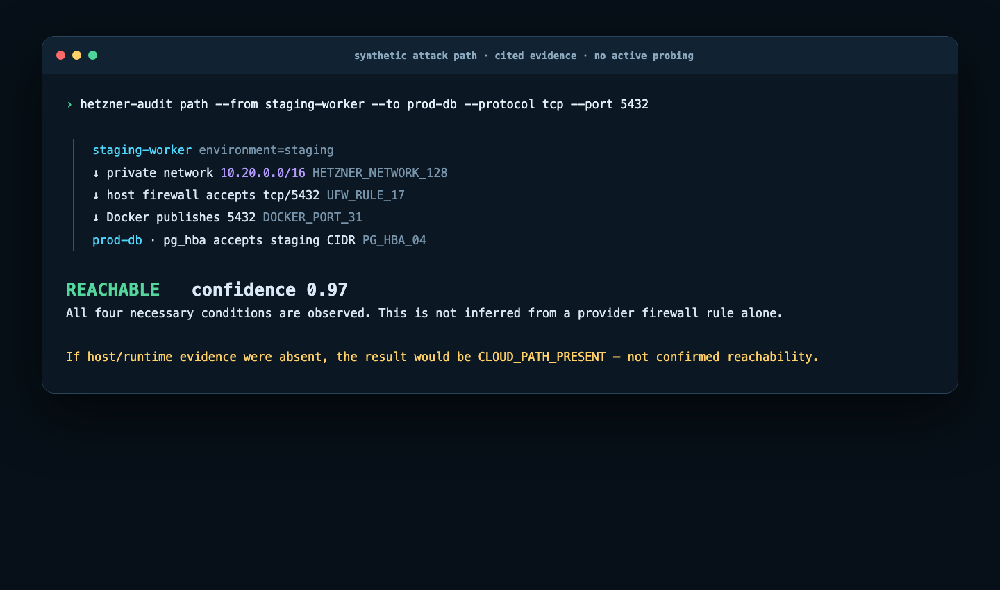
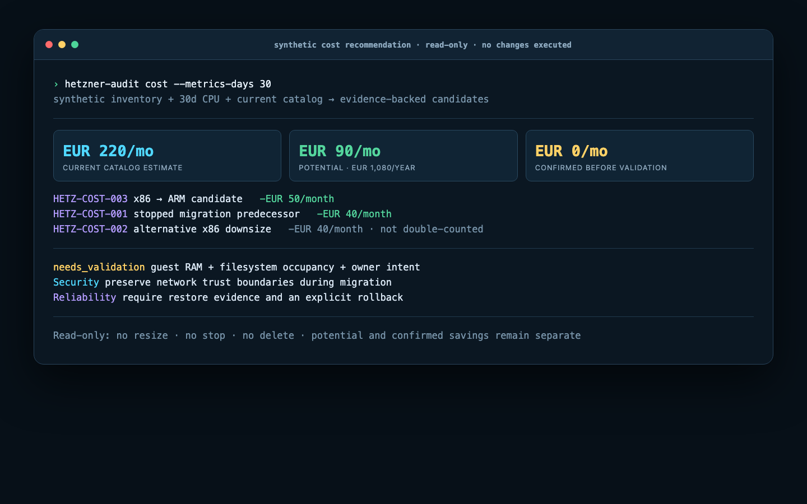
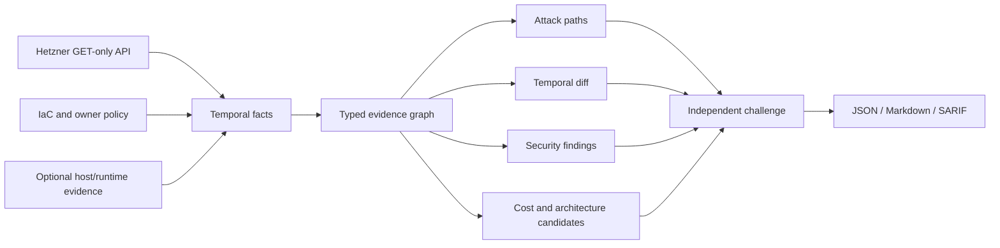

# hetzner-cloud-audit-skills

**One read-only token. Zero SSH. Evidence for what is exposed, what can cross a trust boundary, and what changed.**

This project reconstructs Hetzner Cloud topology and turns provider state into cited attack paths. It does not treat a firewall warning as proof of an exploitable service: missing host, container, or database evidence remains explicitly `needs_validation`.

```text
staging-worker
  → shared Hetzner network
  → prod-db firewall permits tcp/5432
  → host firewall accepts source
  → Docker publishes 5432
  → PostgreSQL HBA accepts staging CIDR

RESULT: REACHABLE
Evidence: network attachment + firewall rule + host rule + container port + pg_hba
```

> Independent open-source project. Not affiliated with or endorsed by Hetzner or Cloudflare. v0.3 is alpha; review every high-impact result before action.

## Install the agent skill

```sh
npx skills add https://github.com/jpolec/hetzner-cloud-audit-skills \
  --skill hetzner-security-audit
```

Then ask your agent:

```text
audit my Hetzner infrastructure
```

Compatible with OpenAI Codex, Claude Code, and other SKILL.md-compatible agents. The top-level skill loads focused network, Linux, Docker, PostgreSQL, Redis, backup, and cost guidance only when evidence makes it applicable.

## First run: API only

Create a project-specific token with **Read** permission using the illustrated [token guide](docs/token-setup.md). Never paste it into an agent prompt, command argument, `.env`, screenshot, or report.

```sh
uvx --from 'git+https://github.com/jpolec/hetzner-cloud-audit-skills@v0.3.0' \
  hetzner-audit audit --read-only --no-ssh --format markdown \
  --output audit.md
```

The report separates:

- facts confirmed by the Hetzner API;
- findings with a complete evidence contract;
- hypotheses requiring host/runtime evidence;
- collector gaps and stale evidence;
- controls that refute an apparent exposure.

The tool performs provider `GET` requests only. It exposes no create, update, resize, power, firewall, or delete operation.

## Three primary questions

### What is publicly reachable?

The API-only core evaluates public interfaces, attached firewall rules, sensitive ports, Cloudflare/Tailscale source controls, missing firewall attachment, IP ownership, and service-policy expectations.

```sh
hetzner-audit ask \
  "Can the Internet reach any database?" \
  --input snapshot.json
```

An absent graph path is not automatically reported as proof of isolation when collector coverage is incomplete.

### What can cross a trust boundary?

```sh
hetzner-audit path \
  --from staging-worker \
  --to prod-db \
  --protocol tcp \
  --port 5432 \
  --input snapshot.json
```

Path results have explicit semantics:

| Result | Meaning |
|---|---|
| `reachable` | Routing, network decision, listener/runtime, and target control are evidenced |
| `cloud_path_present` | Hetzner topology permits the path; host/runtime evidence is missing |
| `unknown` | No allowed path was observed, but evidence is insufficient for a negative proof |



### What changed?

```sh
hetzner-audit snapshot --output before.json --read-only --no-ssh
hetzner-audit snapshot --output after.json --read-only --no-ssh
hetzner-audit diff before.json after.json --fail-on-regression
```

Each temporal fact records its asset, source, observation time, collector version, run ID, evidence path, and value. Diff reports new public edges, asset/fact changes, and collector coverage regressions. A failed collector is not misreported as a removed resource.

Do not commit real snapshots from private infrastructure to a public repository.

## Explain a finding

```sh
hetzner-audit explain HETZ-XLY-002-0123456789abcdef \
  --input snapshot.json
```

`explain` renders the stored evidence chain, attack path, verifier challenge, unresolved prerequisite, and remediation. It does not ask a model to invent a second explanation.

## Owner policy

Generic best practices are weaker than an explicit architecture contract. v0.3 accepts JSON or dependency-free TOML:

```toml
[environments.production]
may_receive_from = ["production"]

[services.postgres]
public = false

[services.redis]
public = false

[ssh]
public = false
```

```sh
hetzner-audit audit \
  --policy policies/example-policy.toml \
  --format markdown --output audit.md
```

Observed facts, owner policy, IaC declarations, and inferred hypotheses remain separate records.

## Cost audit — experimental

Install the focused workflow when the goal is architecture and cost:

```sh
npx skills add https://github.com/jpolec/hetzner-cloud-audit-skills \
  --skill hetzner-cost-audit
```

```sh
hetzner-audit cost --metrics-days 30 --format markdown --output cost.md
```

The first screen gives the number operators need:

```text
Current catalog estimate:       EUR 220.00/month
Potential savings identified:   EUR 90.00/month · EUR 1,080/year
Confirmed savings:              EUR 0/month

Why zero confirmed?
Guest RAM, filesystem occupancy, owner intent, and rollback evidence are incomplete.
```

Recommendations show current type and cost, CPU p95, candidate type, monthly/annual saving, risk, confidence, missing evidence, security/reliability effects, validation, and rollback. The total chooses at most one candidate per asset, so alternative ARM/downsize options are not double-counted.

Cost is not the primary v0.3 message. It consumes the same evidence graph and remains deliberately conservative:

- a stopped server is still billable;
- CPU-only rightsizing is never confirmed without guest RAM and disk evidence;
- ARM savings require image, dependency, and performance validation;
- storage recommendations require occupancy and access-pattern evidence;
- no resize, stop, delete, detach, or purchase action exists in the tool.



## GitHub Action and SARIF

```yaml
- uses: jpolec/hetzner-cloud-audit-skills@v0.3.0
  env:
    HCLOUD_TOKEN: ${{ secrets.HCLOUD_TOKEN }}
  with:
    mode: audit
    policy: policies/infrastructure.toml
    format: sarif
    output: hetzner-audit.sarif
```

Run live collection only from protected `schedule` or `workflow_dispatch` jobs. Do not expose the token to untrusted fork code. See the complete [GitHub Action guide](docs/github-action.md).

SARIF is useful when a finding maps to developer workflow or IaC. Runtime-only topology reports remain available as Markdown and JSON instead of being forced into a fake source location.

## Current capability status

| Capability | v0.3 status |
|---|---|
| Paginated Hetzner Cloud inventory | Beta |
| Endpoint-level collection coverage | Beta |
| Public firewall exposure | Beta |
| Shared-network/lateral cloud paths | Beta; host/runtime remains `needs_validation` |
| Temporal facts, snapshots, and diff | Beta |
| `path`, `explain`, constrained `ask` | Beta |
| JSON/TOML owner policy | Beta |
| JSON, Markdown, SARIF | Beta |
| Cost totals and potential savings | Experimental |
| Linux/Docker/PostgreSQL/Redis | Fixture and operator-evidence workflow |
| Live Terraform-state drift | Not complete |
| Kubernetes/CCM/CSI | Planned after core stabilization |
| AWS/GCP/Azure/OCI adapters | Future; shared engine, not copied skills |
| MCP server | Deferred until schema and authorization stabilize |

## API-only rules with immediate value

The provider-only layer covers:

- public SSH, Docker API, Kubernetes API, PostgreSQL, Redis, Elasticsearch, and MongoDB rules;
- public servers without an attached cloud firewall;
- broad private paths from unrelated workloads to DB/auth/Vault-labelled hosts;
- environment-policy violations when labels and policy provide intent;
- disabled deletion protection on production/foundational resources;
- production state with missing observed native backup coverage;
- ownership-label gaps;
- stopped-but-billed servers, unattached resources, catalog pricing, deprecated types, metrics, and ARM/rightsizing candidates.

Provider evidence cannot prove host listeners, Docker publication, PostgreSQL HBA, Redis ACLs, or guest memory. Those gaps are shown, not guessed.

## Architecture



The workflow is `collect → reason → verify`. Deterministic verification is component separation, not an independent human or agent reviewer. Agent-generated candidates without an independent verifier stay `needs_validation`.

## Benchmark and limitations

The synthetic benchmark plants 33 security problems: 23 meet the deterministic evidence contract and 10 intentionally remain `needs_validation`. New v0.3 tests cover live Hetzner response normalization, temporal facts, coverage-aware diff, attack-path classification, snapshot round trips, and non-overlapping cost totals.

This benchmark measures fixture behavior, not real-world detection accuracy. See [benchmark methodology](benchmarks/README.md), [architecture](docs/architecture.md), [Cloudflare reference analysis](docs/cloudflare-reference.md), [threat model](docs/threat-model.md), and [roadmap](docs/roadmap.md).

## Development

```sh
python -m pip install -e '.[dev]'
ruff check .
mypy src
pytest
./scripts/demo.sh
python scripts/validate_artifacts.py
python -m build
gitleaks detect --no-banner --redact --no-git
```

Runtime code uses the Python standard library. The project uses Apache-2.0 for its explicit patent grant.

## Maintainer

Created and maintained by [Jakub Połeć](https://github.com/jpolec), founder of [QuantJourney](https://quantjourney.cloud).

This is an independent open-source project and is not affiliated with or endorsed by Hetzner or Cloudflare. Security issues should be reported through [GitHub private vulnerability reporting](SECURITY.md), not a public issue.
