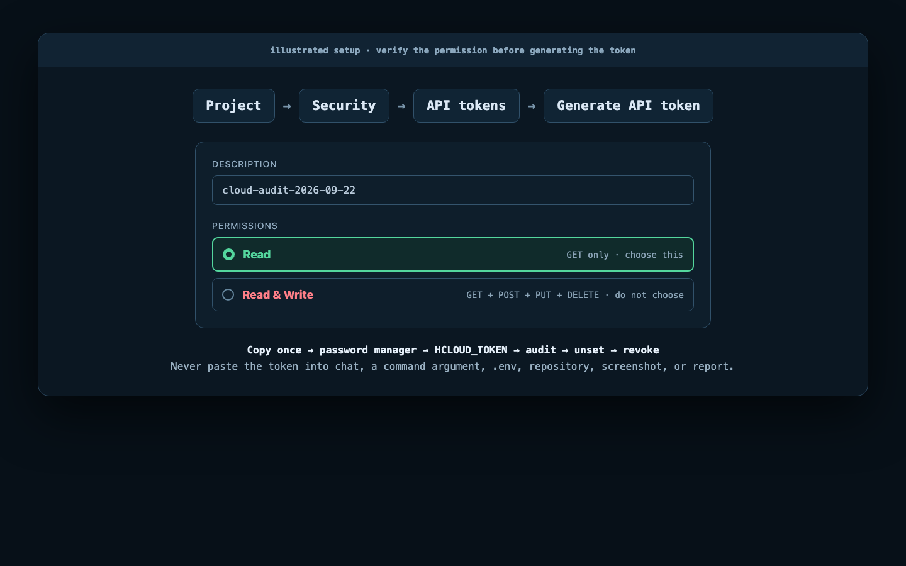

# Create a read-only Hetzner Cloud API token

The audit needs a Hetzner Cloud API token only for live cloud inventory. Create a dedicated **Read** token for each project. Do not reuse a Terraform, application, or administrator token.

> Never paste a token into an AI prompt, issue, shell command argument, `.env` file, repository, screenshot, or report. The project never needs a `Read & Write` token.



The image is an explanatory diagram, not a screenshot of the live Console. Hetzner may change visual styling; the labels and permission behavior below were checked against the official documentation on 2026-09-22.

## 1. Open the correct project

1. Sign in at [console.hetzner.com](https://console.hetzner.com/).
2. Select the project that contains the infrastructure you want to audit.
3. Confirm the project name before creating the token.

Hetzner API tokens are project-bound. A token created in one project cannot inventory another project. Audit multiple projects separately with separate tokens and reports.

## 2. Open API tokens

Inside the selected project:

1. Select **Security** in the left menu.
2. Select **API tokens** in the upper menu.
3. Select **Generate API token**.

This click path is documented in Hetzner's [Generating an API token](https://docs.hetzner.com/cloud/api/getting-started/generating-api-token/) guide.

## 3. Choose `Read`

Enter a description that states the purpose and expected lifetime, for example:

```text
cloud-audit-2026-09-22
```

Select **Read**. Do not select **Read & Write**.

| Console choice | HTTP methods permitted by Hetzner | Suitable for this project |
|---|---|---|
| **Read** | `GET` | Yes |
| **Read & Write** | `GET`, `POST`, `PUT`, `DELETE` | No |

This project contains no Hetzner mutation method. A more powerful token adds risk without improving the audit.

## 4. Copy and store it once

Select **Generate API token**, copy the full value, and place it directly in a password manager or approved secret store. Hetzner displays the complete token only once; afterward, the secret portion cannot be retrieved in full.

If you lose it, delete/revoke the token and create another one. Do not place it in a note inside the repository.

## 5. Load it without exposing it

### Bash or Zsh

This input is not echoed and does not place the value in shell history:

```sh
printf 'Hetzner read-only token: '
IFS= read -rs HCLOUD_TOKEN
printf '\n'
export HCLOUD_TOKEN
```

### PowerShell

```powershell
$secureToken = Read-Host 'Hetzner read-only token' -AsSecureString
$HCLOUD_TOKEN = [System.Net.NetworkCredential]::new('', $secureToken).Password
$env:HCLOUD_TOKEN = $HCLOUD_TOKEN
Remove-Variable HCLOUD_TOKEN, secureToken
```

Environment variables are inherited by child processes. Use a dedicated terminal, run only trusted commands there, and never enable shell tracing such as `set -x` while the token is present.

## 6. Run the safe checks

Check the token, API access, and project scope. The token value is never printed:

```sh
hetzner-audit doctor --report-dir ./_output
```

Confirm the reported server and firewall counts match the project you meant to audit.

You can also preview the planned collector without sending any API request:

```sh
hetzner-audit inventory --dry-run --read-only --no-ssh
```

Then collect live inventory using `GET` requests:

```sh
hetzner-audit inventory \
  --format json \
  --output inventory.json \
  --read-only \
  --no-ssh
```

Run the security audit if required:

```sh
hetzner-audit audit \
  --format json \
  --output findings.json \
  --read-only \
  --no-ssh
```

Treat inventory and findings as sensitive: names, IP addresses, labels, topology, certificates, and SSH-key metadata may reveal internal architecture.

## 7. Confirm that it is really read-only

Confirm **Read** in Hetzner Console when creating the token. The tool deliberately does not attempt `POST`, `PUT`, or `DELETE` to test the permission class; doing so would violate the audit's non-mutating safety boundary.

A successful inventory proves that the token is valid for read requests. It does **not** independently prove that a broader token was not supplied. If you are unsure what you selected, revoke it and create a new **Read** token.

## 8. Remove and revoke it

Remove the environment variable after the audit:

```sh
unset HCLOUD_TOKEN
```

In PowerShell:

```powershell
Remove-Item Env:HCLOUD_TOKEN
```

For a one-time audit, return to the same project and open **Security → API tokens**, select the audit token, and delete it. Hetzner documents token deletion under its [Console cancellation instructions](https://docs.hetzner.com/general/billing-and-account-management/cancellation/cancellations-hetzner-console/#canceling-api-tokens).

Revoke immediately if a token appears in chat, logs, screenshots, shell history, a repository, CI output, or an untrusted process environment. Create a replacement; do not try to recover or reuse the exposed value.

## CI usage

Store the token as a masked CI environment or repository secret named `HCLOUD_TOKEN`. Expose it only to the audit step:

```yaml
permissions:
  contents: read

steps:
  - uses: actions/checkout@v7
  - name: Read-only Hetzner inventory
    env:
      HCLOUD_TOKEN: ${{ secrets.HCLOUD_TOKEN }}
    run: hetzner-audit inventory --format json --output inventory.json --read-only --no-ssh
```

Do not make the secret available to workflows from untrusted forks. Do not publish raw inventory as a public CI artifact. Use protected environments and approval gates where appropriate.

## Troubleshooting

| Symptom | Safe interpretation and next action |
|---|---|
| `HCLOUD_TOKEN is not set` | Load it into the same terminal/process that starts the audit. Do not paste it into the command. |
| Authentication failure | The value may be incomplete, revoked, or from a different environment. Revoke and create a new token if uncertain. |
| Empty or unexpected inventory | Confirm that the token was created in the intended project; tokens cannot cross project boundaries. |
| Unsure whether `Read` was selected | Do not test with a write. Revoke and recreate it with **Read** selected. |
| Token appeared in output | Stop, revoke it immediately, remove the exposed artifact where possible, and issue a replacement. |

## Before starting the audit

- [ ] The correct Hetzner project is open.
- [ ] A dedicated audit token was created.
- [ ] **Read** was selected—not **Read & Write**.
- [ ] The full value was saved once in an approved secret store.
- [ ] The value is available only through `HCLOUD_TOKEN`.
- [ ] SSH remains disabled unless separately authorized.
- [ ] Output files will be stored as sensitive artifacts.
- [ ] The token will be revoked when no longer required.

## Official sources

- [Generating an API token](https://docs.hetzner.com/cloud/api/getting-started/generating-api-token/)
- [Using the API and project-bound tokens](https://docs.hetzner.com/cloud/api/getting-started/using-api/)
- [How API tokens are stored](https://docs.hetzner.com/cloud/api/faq/#how-are-api-tokens-stored)
- [Deleting API tokens](https://docs.hetzner.com/general/billing-and-account-management/cancellation/cancellations-hetzner-console/#canceling-api-tokens)
