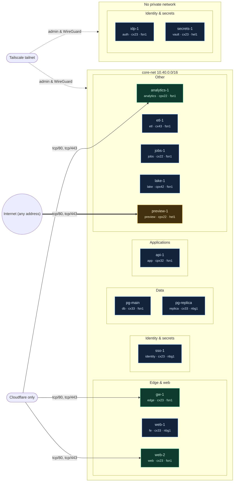

# Hetzner Network Map

Collected at: 2026-09-19T06:12:00+00:00 · servers: 14 · private: 10 · proxied: 3 · public: 1

Exposure: **critical** = sensitive port or all ports open to any address, or no cloud firewall; **public** = other ports open to any address; **proxied** = reachable only through Cloudflare; **private** = no public ingress except the Tailscale WireGuard port. Hetzner Cloud Firewalls do not filter private networks, so members of one network reach each other on every port.

| Server | Group | Type | Exposure | Public ingress | Private / admin ingress |
|---|---|---|---|---|---|
| analytics-1 | Other | cpx22 | proxied | Cloudflare only: tcp/80, tcp/443 | Tailscale tailnet: tcp/22, udp/41641 (WireGuard); core-net: all ports (not filtered by cloud firewalls) |
| api-1 | Applications | cpx32 | private | none (ICMP only) | Tailscale tailnet: tcp/22, udp/41641 (WireGuard), tcp/all, udp/all; core-net: all ports (not filtered by cloud firewalls) |
| etl-1 | Other | cx43 | private | none (ICMP only) | Tailscale tailnet: udp/41641 (WireGuard), tcp/all; core-net: all ports (not filtered by cloud firewalls) |
| gw-1 | Edge & web | cx23 | proxied | Cloudflare only: tcp/80, tcp/443 | Tailscale tailnet: tcp/22, udp/41641 (WireGuard), tcp/all, udp/all; core-net: all ports (not filtered by cloud firewalls) |
| idp-1 | Identity & secrets | cx23 | private | none (ICMP only) | Tailscale tailnet: udp/41641 (WireGuard) |
| jobs-1 | Other | cx22 (deprecated) | private | none (ICMP only) | Tailscale tailnet: udp/41641 (WireGuard); core-net: all ports (not filtered by cloud firewalls) |
| lake-1 | Other | cpx42 | private | none (ICMP only) | Tailscale tailnet: tcp/22, tcp/7001, udp/41641 (WireGuard); core-net: all ports (not filtered by cloud firewalls) |
| pg-main | Data | cx33 | private | none (ICMP only) | Tailscale tailnet: tcp/22, udp/41641 (WireGuard), tcp/all, udp/all; core-net: all ports (not filtered by cloud firewalls) |
| pg-replica | Data | cx33 | private | none (ICMP only) | Tailscale tailnet: tcp/22, udp/41641 (WireGuard), tcp/all, udp/all; core-net: all ports (not filtered by cloud firewalls) |
| preview-1 | Other | cpx22 | public | Internet (any address): tcp/80, tcp/443 | Tailscale tailnet: tcp/22, udp/41641 (WireGuard); core-net: all ports (not filtered by cloud firewalls) |
| secrets-1 | Identity & secrets | cx23 | private | none (ICMP only) | Tailscale tailnet: udp/41641 (WireGuard) |
| sso-1 | Identity & secrets | cx23 | private | none (ICMP only) | Tailscale tailnet: tcp/22, udp/41641 (WireGuard), tcp/all, udp/all; core-net: all ports (not filtered by cloud firewalls) |
| web-1 | Edge & web | cx33 | private | none (ICMP only) | Tailscale tailnet: tcp/22, udp/41641 (WireGuard), tcp/all, udp/all; core-net: all ports (not filtered by cloud firewalls) |
| web-2 | Edge & web | cx23 | proxied | Cloudflare only: tcp/80, tcp/443 | Tailscale tailnet: udp/41641 (WireGuard); core-net: all ports (not filtered by cloud firewalls) |

Unattached volumes: orphan-data

Public IP addresses are intentionally omitted. The map shows provider firewall intent, not host or application controls.
