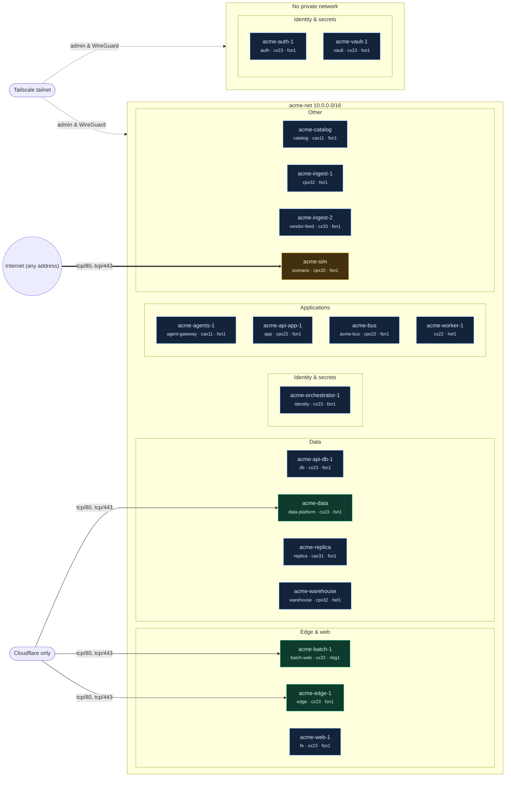

# Hetzner Network Map

Collected at: 2026-09-23T07:22:24.367180+00:00 · servers: 18 · private: 14 · proxied: 3 · public: 1

Exposure: **critical** = sensitive port or all ports open to any address, or no cloud firewall; **public** = other ports open to any address; **proxied** = reachable only through Cloudflare; **private** = no public ingress except the Tailscale WireGuard port.

| Server | Group | Type | Exposure | Public ingress | Private / admin ingress |
|---|---|---|---|---|---|
| acme-agents-1 | Applications | cax11 | private | none (ICMP only) | Tailscale tailnet: udp/41641 (WireGuard) |
| acme-api-app-1 | Applications | cpx22 | private | none (ICMP only) | Tailscale tailnet: tcp/2222, udp/41641 (WireGuard), tcp/all, udp/all; Private network: tcp/all, udp/all |
| acme-api-db-1 | Data | cx23 | private | none (ICMP only) | Tailscale tailnet: tcp/2222, udp/41641 (WireGuard), tcp/all, udp/all; Private network: tcp/all, udp/all |
| acme-auth-1 | Identity & secrets | cx23 | private | none (ICMP only) | Tailscale tailnet: udp/41641 (WireGuard) |
| acme-batch-1 | Edge & web | cx33 | proxied | Cloudflare only: tcp/80, tcp/443 | Tailscale tailnet: udp/41641 (WireGuard) |
| acme-bus | Applications | cpx22 | private | none (ICMP only) | Tailscale tailnet: udp/41641 (WireGuard) |
| acme-catalog | Other | cax11 | private | none (ICMP only) | Tailscale tailnet: tcp/2222, tcp/8000, udp/41641 (WireGuard); Private network: tcp/8000, tcp/all, udp/all |
| acme-data | Data | cx23 | proxied | Cloudflare only: tcp/80, tcp/443 | Tailscale tailnet: tcp/2222, udp/41641 (WireGuard); Private network: tcp/all, udp/all |
| acme-edge-1 | Edge & web | cx23 | proxied | Cloudflare only: tcp/80, tcp/443 | Tailscale tailnet: tcp/2222, udp/41641 (WireGuard), tcp/all, udp/all; Private network: tcp/all, udp/all |
| acme-ingest-1 | Other | cpx32 | private | none (ICMP only) | Tailscale tailnet: udp/41641 (WireGuard), tcp/all |
| acme-ingest-2 | Other | cx33 | private | none (ICMP only) | Tailscale tailnet: tcp/2222, tcp/9101, udp/41641 (WireGuard); Private network: tcp/9101, tcp/all, udp/all |
| acme-orchestrator-1 | Identity & secrets | cx23 | private | none (ICMP only) | Tailscale tailnet: tcp/2222, udp/41641 (WireGuard), tcp/all, udp/all; Private network: tcp/all, udp/all |
| acme-replica | Data | cax31 | private | none (ICMP only) | Tailscale tailnet: tcp/2222, udp/41641 (WireGuard), tcp/all, udp/all; Private network: tcp/all, udp/all |
| acme-sim | Other | cpx32 | public | Internet (any address): tcp/80, tcp/443 | Tailscale tailnet: tcp/2222, udp/41641 (WireGuard); Private network: tcp/all, udp/all |
| acme-vault-1 | Identity & secrets | cx23 | private | none (ICMP only) | Tailscale tailnet: udp/41641 (WireGuard) |
| acme-warehouse | Data | cpx32 | private | none (ICMP only) | Tailscale tailnet: tcp/2222, tcp/9102, udp/41641 (WireGuard); Private network: tcp/9102, tcp/all, udp/all |
| acme-web-1 | Edge & web | cx23 | private | none (ICMP only) | Tailscale tailnet: tcp/2222, udp/41641 (WireGuard), tcp/all, udp/all; Private network: tcp/all, udp/all |
| acme-worker-1 | Applications | cx22 (deprecated) | private | none (ICMP only) | Tailscale tailnet: udp/41641 (WireGuard) |

Unattached volumes: acme-batch-data

Public IP addresses are intentionally omitted. The map shows provider firewall intent, not host or application controls.
